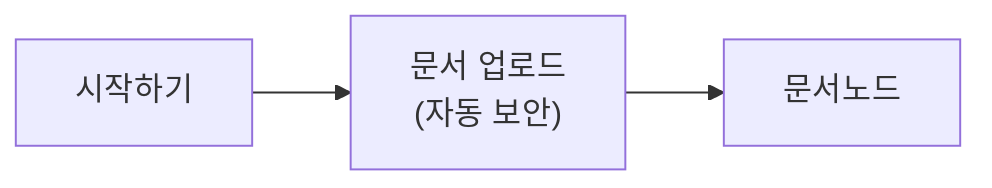

# 엣지 케이스 문서

인라인 코드 `analysis.config` 를 수정하고 `--verbose` 옵션을 붙이세요.

*기울임* 과 _밑줄 기울임_ 도 있습니다.

이스케이프 문자 \& 와 \* 를 그대로 두어야 합니다.

```bash
# 이 블록은 번역하면 안 됩니다
echo "분석 시작"
```

| 항목 | 설명 |
| --- | --- |
| 저장소 | 소스코드 저장소입니다 |
| 사용자 ID | 관리자가 등록합니다<font color="#0C121D">*</font> |
| 비고 | - |
| `admin.config` | 설정 파일입니다 |

- 중첩 목록 상위
  - 중첩 목록 하위 항목
- **굵은 항목** 과 `코드` 혼합

여러 줄에 걸쳐
하드랩된 문단입니다.

<Admonition type="tip" title="주의">
JSX 블록 안쪽 본문입니다.
</Admonition>

<Tabs
  values={[
    {label: '설치', value: 'install'},
  ]}>
여러 줄 속성 뒤의 본문입니다.
</Tabs>

## 이미 id가 있는 헤딩 {#custom-anchor}

## Virtual Drive 설정하기

본문에서도 Virtual Drive 를 씁니다.

`백틱 안의 한국어 문구도 번역합니다.` 그러나 `#custom-anchor` 는 그대로 둡니다.



끝.
